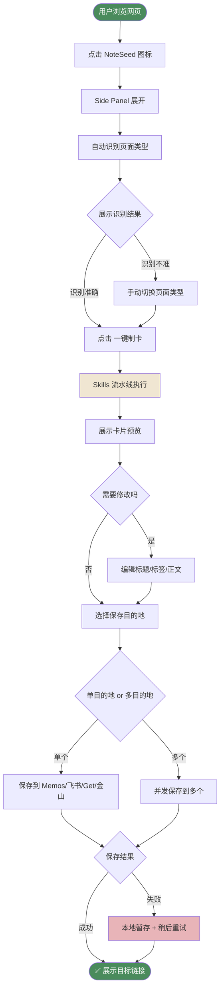
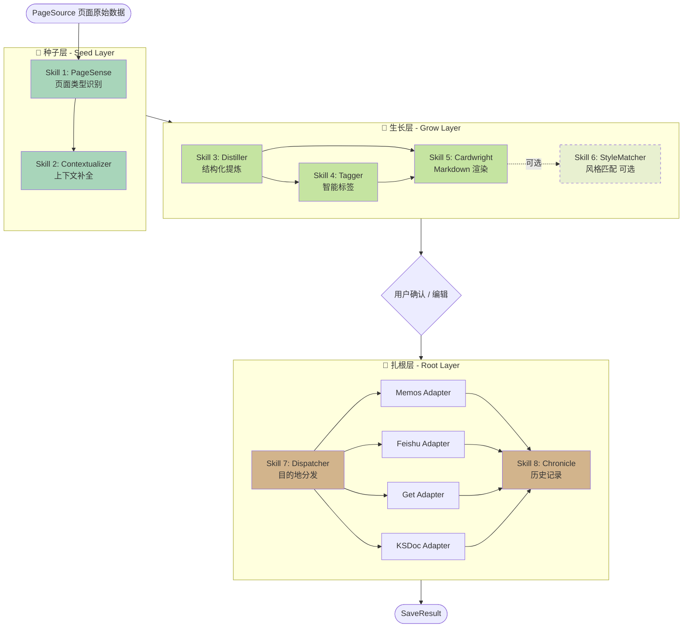
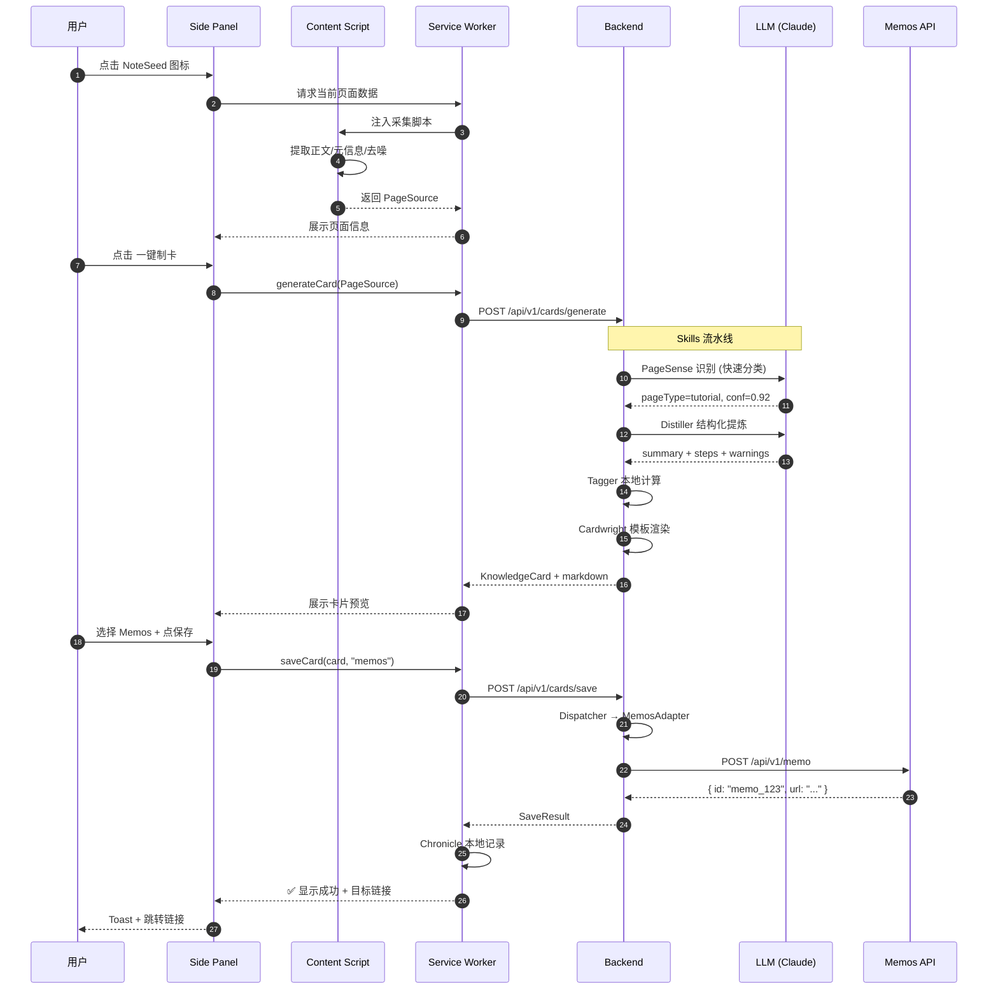
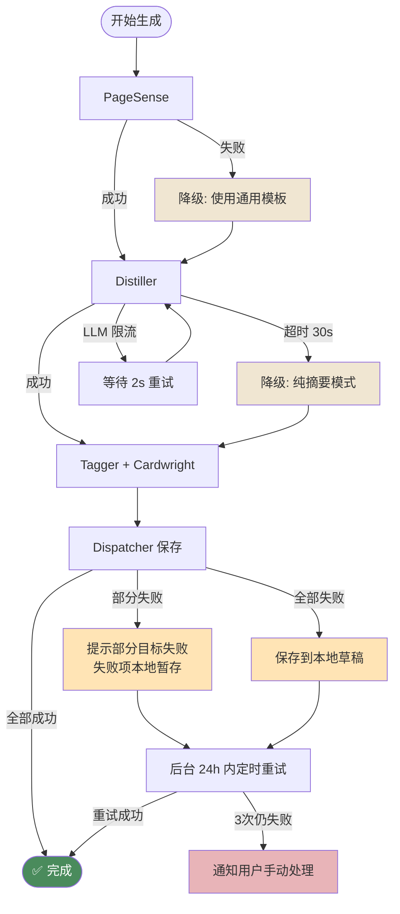
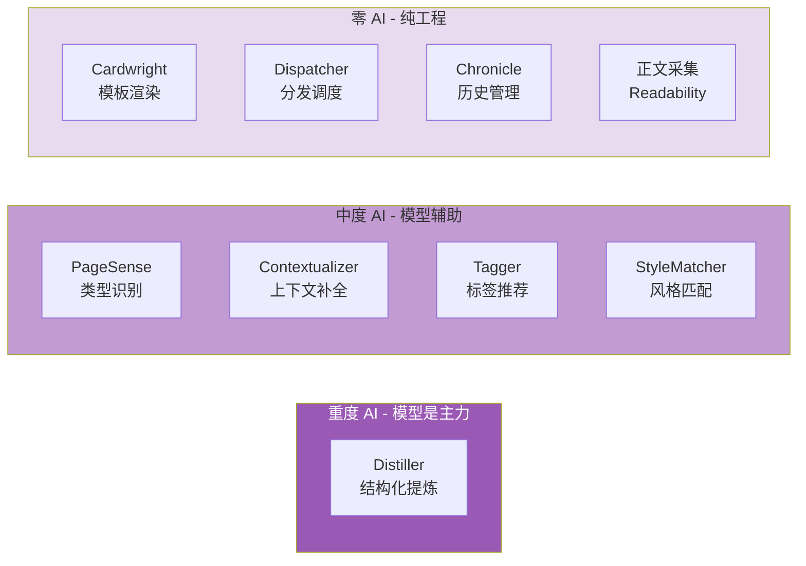

# NoteSeed 技术架构附录

> 本文档作为 NoteSeed PRD 的配套技术补充，覆盖：
>
> - **三视角可视化流程图**（业务、Skills、架构）
> - **开发技术栈全貌**
> - **AI 能力全景**
> - **API 汇总（内部 + 外部）**
>
> 所有流程图使用 Mermaid 语法，可直接在 GitHub / 语雀 / 飞书文档 / Typora / Notion 中渲染。

---

## 目录

1. [可视化流程图](#1-可视化流程图)
   - 1.1 业务流程图（用户视角）
   - 1.2 Skills 技能流水线（内部调度视角）
   - 1.3 插件技术架构（组件/通信视角）
   - 1.4 数据流时序图
   - 1.5 错误与降级路径
2. [开发技术栈](#2-开发技术栈)
3. [AI 能力全景](#3-ai-能力全景)
4. [API 汇总](#4-api-汇总)

---

## 1. 可视化流程图

### 1.1 业务流程图（用户视角）

从用户点击插件到卡片落地笔记系统，全过程用户会"看到"的动作。



**关键节点说明**：

| 节点 | 耗时预期 | 用户感知 |
|---|---|---|
| Side Panel 展开 | < 500ms | 即时 |
| 自动识别页面类型 | 1~2s | 展示 loading |
| Skills 流水线 | 5~10s | 分步展示进度 |
| 卡片预览 | 即时 | 支持实时编辑 |
| 保存到单目的地 | 1~3s | Toast 提示 |

---

### 1.2 Skills 技能流水线（内部调度视角）

展示 8 个 Skills 的调度关系、并行/串行、可选/必选。



**Skills 执行特征**：

| Skill | 串/并行 | 是否必需 | 典型耗时 | AI 参与度 |
|---|---|---|---|---|
| PageSense | 串行 | 必需 | 0.8~1.5s | 中 |
| Contextualizer | 串行 | 必需 | 0.5~1s | 低 |
| Distiller | 串行 | 必需 | 3~6s | 高 |
| Tagger | 可与 Cardwright 并行 | 必需 | 0.8~1.5s | 中 |
| Cardwright | 依赖 Distiller + Tagger | 必需 | 0.2~0.5s | 无（模板渲染） |
| StyleMatcher | 可选（串行于 Cardwright 后） | 可选 | 1~2s | 中 |
| Dispatcher | 用户确认后执行 | 必需 | 1~3s/目的地 | 无 |
| Chronicle | 本地异步 | 可选 | < 100ms | 无 |

---

### 1.3 插件技术架构（组件/通信视角）

展示浏览器插件各组件、服务端、外部 API 的通信关系。

```mermaid
flowchart LR
    subgraph Browser [浏览器环境]
        direction TB
        WebPage[网页 Tab]
        CS[Content Script<br/>正文采集]
        SP[Side Panel<br/>React UI]
        SW[Service Worker<br/>后台调度]
        OP[Options Page<br/>设置中心]
        IDB[(IndexedDB<br/>本地卡片/设置)]

        WebPage <-.注入.-> CS
        CS <-.消息.-> SW
        SP <-.消息.-> SW
        OP <-.消息.-> SW
        SW <--> IDB
    end

    subgraph Backend [NoteSeed 后端]
        direction TB
        GW[API Gateway]
        Skills[Skills Orchestrator<br/>技能编排]
        Adapters[Adapter 层]
        DB[(PostgreSQL<br/>用户设置/日志)]
        Cache[(Redis<br/>缓存/限流)]

        GW --> Skills
        GW --> Adapters
        Skills <--> Cache
        GW <--> DB
    end

    subgraph AI [AI 服务]
        LLM1[Claude API]
        LLM2[OpenAI API]
        LLM3[本地 Ollama<br/>v1.2]
    end

    subgraph External [外部笔记系统]
        Memos[Memos API]
        Feishu[飞书 Open API]
        Get[Get 笔记 API]
        KSDoc[金山文档 API]
    end

    SW <-.HTTPS.-> GW
    Skills <-.调用.-> LLM1
    Skills <-.调用.-> LLM2
    Skills -.v1.2.-> LLM3
    Adapters --> Memos
    Adapters --> Feishu
    Adapters --> Get
    Adapters --> KSDoc

    style Browser fill:#E8F4F8
    style Backend fill:#FFF4E6
    style AI fill:#F3E8FF
    style External fill:#E8F5E9
```

**通信协议总览**：

| 通道 | 协议 | 用途 |
|---|---|---|
| Content Script ↔ Service Worker | `chrome.runtime.sendMessage` | 页面采集数据传递 |
| Side Panel ↔ Service Worker | `chrome.runtime.sendMessage` | UI 操作命令 |
| Service Worker ↔ Backend | HTTPS + JWT | Skills 调用、保存操作 |
| Backend ↔ LLM | HTTPS + API Key | 模型调用 |
| Backend ↔ 笔记系统 | HTTPS + OAuth/Token | 卡片写入 |
| Service Worker ↔ IndexedDB | 原生 API | 本地持久化 |

---

### 1.4 数据流时序图

一次完整的"点击 → 卡片落地 Memos"请求的时序。



---

### 1.5 错误与降级路径

真实产品绕不开的异常流。展示各失败点的降级策略。



**降级策略表**：

| 失败点 | 降级策略 | 用户感知 |
|---|---|---|
| PageSense 失败 | 回退到 `generic` 通用模板 | 无感，卡片仍生成 |
| Distiller 超时 | 回退到"纯摘要 + 关键点"简版 | 提示"已降级" |
| LLM 限流 | 指数退避重试 2 次 | 加载延长 3~5s |
| 单个笔记系统失败 | 本地暂存，后台重试 | Toast 提示"稍后重试" |
| 全部目的地失败 | 本地草稿 | 明确告知用户 |

---

## 2. 开发技术栈

按模块分层列出技术选型理由。

### 2.1 浏览器插件端

| 层级 | 技术 | 版本 | 选型理由 |
|---|---|---|---|
| **规范** | Chrome Manifest V3 | - | Chrome 强制要求，Edge 同源 |
| **UI 框架** | React | 18.x | 生态最成熟，Side Panel 适配度高 |
| **构建工具** | Vite + CRXJS | Vite 5 / CRXJS 2 | CRXJS 是目前最稳的 MV3 插件构建方案 |
| **语言** | TypeScript | 5.x | 类型安全；KnowledgeCard 协议强类型 |
| **样式** | Tailwind CSS | 3.x | 快速迭代，体积小 |
| **UI 组件** | shadcn/ui | latest | 高度可定制，不锁死设计 |
| **状态管理** | Zustand | 4.x | 比 Redux 轻，适合插件小型 store |
| **Markdown 渲染** | react-markdown + remark-gfm | - | 支持 GFM 扩展（表格、任务列表） |
| **代码高亮** | Shiki | 1.x | 基于 TextMate，支持 VS Code 主题 |
| **本地存储** | Dexie.js (IndexedDB 封装) | 4.x | 比原生 IndexedDB API 友好得多 |
| **页面正文提取** | @mozilla/readability | 0.5.x | Firefox Reader View 同款，鲁棒 |
| **DOM 清洗** | DOMPurify | 3.x | 防 XSS，剔除广告脚本 |
| **HTML → Markdown** | Turndown | 7.x | 成熟，支持自定义规则 |

### 2.2 后端服务

| 层级 | 技术 | 版本 | 选型理由 |
|---|---|---|---|
| **运行时** | Node.js | 20 LTS | 与前端 TS 共享类型定义 |
| **Web 框架** | Fastify | 4.x | 比 Express 快，schema 校验内建 |
| **语言** | TypeScript | 5.x | - |
| **ORM** | Prisma | 5.x | 类型安全的 DB 访问 |
| **数据库** | PostgreSQL | 16.x | 用户设置、日志、save_logs |
| **缓存** | Redis | 7.x | Skills 结果缓存、限流 |
| **队列** | BullMQ (基于 Redis) | 5.x | Dispatcher 异步重试 |
| **校验** | Zod | 3.x | 前后端共享 schema |
| **鉴权** | JWT + OAuth 2.0 | - | 用户鉴权 + 第三方笔记系统授权 |
| **日志** | Pino | 9.x | 性能好，结构化日志 |
| **可观测** | OpenTelemetry | - | Skills 耗时追踪 |

### 2.3 AI / Skills 层

| 层级 | 技术 | 用途 |
|---|---|---|
| **主模型 API** | Anthropic Claude API | 主力模型（PageSense / Distiller / Tagger） |
| **备用模型** | OpenAI API | 容灾备份 |
| **本地模型**（v1.2） | Ollama + Llama 3.1 / Qwen 2.5 | 纯本地模式 |
| **Prompt 管理** | PromptLayer 或自研 | 版本化、A/B 测试 |
| **Embedding** | `text-embedding-3-small` | 去重、系列文检测 |
| **向量库**（v1.1+） | pgvector (PostgreSQL 插件) | Chronicle 相似度检索 |

### 2.4 基础设施

| 层级 | 技术 | 选型理由 |
|---|---|---|
| **部署** | Docker + Kubernetes | 或 Fly.io / Railway 起步 |
| **CDN** | Cloudflare | 静态资源 + WAF |
| **错误监控** | Sentry | 前后端统一 |
| **分析** | PostHog（自托管） | 隐私友好，符合产品调性 |
| **CI/CD** | GitHub Actions | 自动化构建、插件签名 |
| **密钥管理** | Doppler 或 Infisical | 环境变量安全管理 |

### 2.5 测试

| 层级 | 技术 |
|---|---|
| 单元测试 | Vitest |
| 组件测试 | Testing Library |
| E2E（插件） | Playwright + chrome-extension-testing |
| API 测试 | Supertest |
| Skills 评估 | 自研 eval 集（每种 pageType 准备 20 个样本页） |

---

## 3. AI 能力全景

**NoteSeed 是一个 AI 原生产品**，但 AI 不是全部——产品把"AI 用在刀刃上"，有的 Skill 重 AI，有的 Skill 完全不用。

### 3.1 AI 能力分级



### 3.2 各 AI 能力详解

| Skill | 模型职责 | 推荐模型 | 单次 token 估算 |
|---|---|---|---|
| **PageSense** | 融合多信号做分类仲裁 | Claude Haiku（便宜快） | 输入 1k / 输出 100 |
| **Contextualizer** | 识别系列文、补全代词指代 | Claude Haiku | 输入 2k / 输出 300 |
| **Distiller** | 按 pageType 做结构化提炼（核心 AI 能力） | Claude Sonnet（质量优先） | 输入 5k~15k / 输出 1k |
| **Tagger** | 基于 embedding + LLM 混合推荐 | Haiku + embedding 模型 | 输入 2k / 输出 100 |
| **StyleMatcher** | 改写 Markdown 以匹配用户风格 | Claude Sonnet | 输入 3k / 输出 1k |

### 3.3 AI 调用策略

**1. 分级调用——省钱关键**

- 轻任务（PageSense / Tagger）用 **Haiku**
- 重任务（Distiller）用 **Sonnet**
- 不用 Opus（性价比不够，非 NoteSeed 场景）

**2. Prompt 缓存**

Distiller 的 system prompt 每种 pageType 不变，用 Anthropic 的 prompt caching 可节省 70%+ 成本。

**3. 流式输出**

Distiller 使用 streaming，卡片在 Side Panel 中"打字机"式浮现，消解等待感。

**4. 批处理（v1.2）**

批量转卡场景使用 Message Batches API，50% 折扣。

**5. 本地模型容灾**

v1.2 支持 Ollama，用户可配置本地模型做完全离线处理。

### 3.4 AI 成本估算（单用户月度）

**假设：每用户每月制卡 50 张。**

| 项目 | 单次成本 | 月成本 |
|---|---|---|
| PageSense (Haiku) | ~$0.0003 | $0.015 |
| Contextualizer (Haiku) | ~$0.0005 | $0.025 |
| Distiller (Sonnet, 含缓存) | ~$0.015 | $0.75 |
| Tagger (Haiku + embedding) | ~$0.0008 | $0.04 |
| StyleMatcher (Sonnet, 可选) | ~$0.008 | $0.40 |
| **合计** | **~$0.025 / 卡** | **~$1.25 / 月** |

按 $10/月 订阅价，毛利率约 87%。健康。

### 3.5 提示工程核心策略

- **Few-shot Examples**：每个 pageType 在 system prompt 中嵌入 2~3 个 high-quality 示例
- **JSON Schema 约束**：使用 Anthropic 的 structured output 确保返回格式可解析
- **温度分层**：PageSense/Tagger 用 `temperature=0`（确定性），Distiller 用 `0.3`（略微发挥），StyleMatcher 用 `0.7`（风格化）
- **链式思考**：Distiller 内部使用 `<thinking>` tag 先分析结构再输出，提升质量
- **拒绝兜底**：所有 Prompt 都有"若无法处理，返回 `{"error": "reason"}`"的兜底

---

## 4. API 汇总

### 4.1 内部 API（NoteSeed Backend）

#### 4.1.1 卡片相关

| Method | Path | 用途 | 触发 Skills |
|---|---|---|---|
| POST | `/api/v1/cards/generate` | 生成卡片 | Skill 1~6 |
| POST | `/api/v1/cards/save` | 保存到目的地 | Skill 7 |
| GET | `/api/v1/cards/:id` | 获取卡片详情 | - |
| PATCH | `/api/v1/cards/:id` | 更新卡片字段 | - |
| DELETE | `/api/v1/cards/:id` | 删除卡片 | - |
| GET | `/api/v1/cards/recent` | 最近卡片列表 | - |

#### 4.1.2 用户设置

| Method | Path | 用途 |
|---|---|---|
| GET | `/api/v1/settings` | 获取用户设置 |
| PATCH | `/api/v1/settings` | 更新设置 |
| POST | `/api/v1/settings/credentials` | 添加/更新第三方系统凭证 |
| DELETE | `/api/v1/settings/credentials/:target` | 删除凭证 |
| GET | `/api/v1/settings/skills` | 获取 Skills 开关状态 |
| PATCH | `/api/v1/settings/skills` | 切换 Skills 开关 |

#### 4.1.3 风格档案

| Method | Path | 用途 |
|---|---|---|
| POST | `/api/v1/style-profile/sample` | 上传样本生成 userStyleProfile |
| GET | `/api/v1/style-profile` | 获取当前风格档案 |
| DELETE | `/api/v1/style-profile` | 清除风格档案 |

#### 4.1.4 鉴权

| Method | Path | 用途 |
|---|---|---|
| POST | `/api/v1/auth/login` | 登录（邮箱 + magic link） |
| POST | `/api/v1/auth/refresh` | 刷新 token |
| POST | `/api/v1/auth/oauth/:provider/callback` | OAuth 回调（飞书/金山） |

#### 4.1.5 可观测

| Method | Path | 用途 |
|---|---|---|
| POST | `/api/v1/telemetry/event` | 前端事件上报（匿名） |
| POST | `/api/v1/telemetry/error` | 错误上报 |

### 4.2 外部 API（第三方笔记系统）

#### 4.2.1 Memos API

- **认证**：Bearer Token（用户自建实例）
- **核心端点**：
  - `POST /api/v1/memo` — 创建笔记
  - `GET /api/v1/memo/{id}` — 获取笔记
  - `PATCH /api/v1/memo/{id}` — 更新
- **特点**：自建，私有部署，URL 因人而异

#### 4.2.2 飞书开放平台 API

- **认证**：OAuth 2.0（tenant_access_token + user_access_token）
- **核心端点**：
  - `POST /open-apis/docx/v1/documents` — 创建文档
  - `POST /open-apis/docx/v1/documents/{id}/blocks/batch_create` — 追加块
  - `POST /open-apis/drive/v1/files/upload_all` — 上传文件
- **申请**：需在飞书开放平台注册应用，获取 App ID + App Secret
- **限流**：50 QPS（应用级）

#### 4.2.3 金山文档 API

- **认证**：OAuth 2.0
- **核心端点**：
  - `POST /api/v3/files` — 创建 Markdown 文档
  - `PUT /api/v3/files/{id}/content` — 更新内容
- **注意**：需企业账号申请 API 权限

#### 4.2.4 Get 笔记 API

- **认证**：Token（用户自主生成）
- **核心端点**：
  - `POST /notes` — 创建笔记
  - `GET /notebooks` — 获取笔记本列表
- **说明**：Get 笔记为相对小众产品，API 需从产品方确认最新文档

### 4.3 AI 服务 API

#### 4.3.1 Anthropic Claude API（主）

- **端点**：`https://api.anthropic.com/v1/messages`
- **模型**：
  - `claude-haiku-4-5-20251001` — PageSense / Contextualizer / Tagger
  - `claude-sonnet-4-6` — Distiller / StyleMatcher
- **关键特性使用**：
  - Prompt Caching（节省成本）
  - Streaming（Side Panel 流式展示）
  - Tool Use / Structured Output（JSON 约束）
  - Message Batches API（v1.2 批量场景，50% 折扣）

#### 4.3.2 OpenAI API（备）

- **端点**：`https://api.openai.com/v1/chat/completions`
- **模型**：`gpt-4o-mini`（备用）+ `text-embedding-3-small`（Embedding）
- **用途**：主模型故障时容灾 + Embedding 向量生成

#### 4.3.3 Ollama（v1.2，本地）

- **端点**：`http://localhost:11434/api/generate`
- **模型**：`llama3.1:8b` / `qwen2.5:7b`
- **用途**：纯离线模式

### 4.4 浏览器 API（插件内）

| API | 用途 |
|---|---|
| `chrome.sidePanel` | 侧边栏展示 |
| `chrome.scripting.executeScript` | 注入采集脚本 |
| `chrome.runtime.sendMessage` | 组件间通信 |
| `chrome.storage.local` | 轻量设置（不敏感） |
| `chrome.storage.session` | 临时会话数据 |
| `chrome.action` | 图标点击响应 |
| `chrome.tabs` | 获取当前 Tab 信息 |
| `chrome.notifications` | 成功/失败提示 |
| IndexedDB (via Dexie) | 本地卡片历史 |
| Web Crypto API | 本地凭证加密 |

### 4.5 API 汇总速查表

| 类别 | 数量 | 说明 |
|---|---|---|
| 内部 API 端点 | ~18 个 | 卡片、设置、风格、鉴权、遥测 |
| 外部笔记系统 | 4 个系统 | Memos / 飞书 / 金山 / Get |
| AI 服务 | 3 个（主/备/本地） | Anthropic / OpenAI / Ollama |
| 浏览器 API | ~10 个 | Chrome Extension APIs + Web APIs |

---

## 5. 小结

**NoteSeed 不是一个"用了 AI 的工具"，而是一个"由 Skills 编排 + AI 驱动 + 插件交付"的知识入口**。

三句话总结本文档要点：

1. **流程图**：业务层面 10 秒节奏，Skills 层面 8 技能三层分工，架构层面浏览器插件 + 后端 + AI + 笔记系统四方协同。
2. **技术栈**：前端 React + Vite + CRXJS（MV3 插件最佳实践），后端 Node + Fastify + Prisma，AI 以 Claude 为主、OpenAI 为备、Ollama 为离线方案。
3. **AI 能力**：按 Skill 分级使用模型（重任务 Sonnet、轻任务 Haiku），通过 Prompt 缓存 + 流式输出控制成本至 ~$1.25/用户/月。

---

**—— 附录结束 ——**
